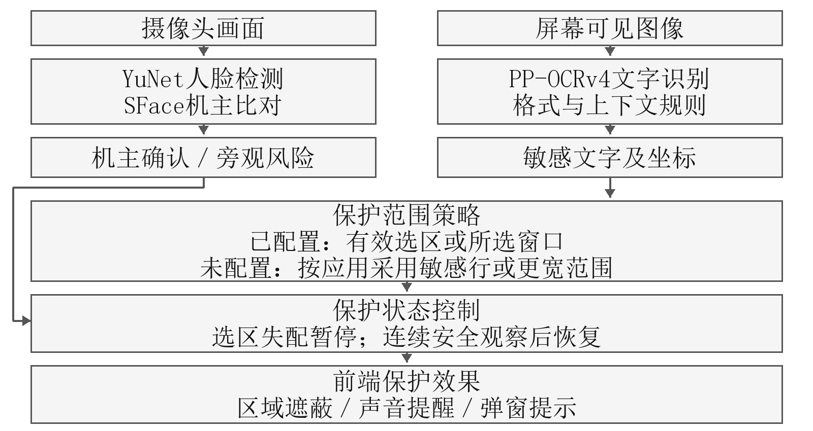

# 视界盾 2026AIC作品方案

内容核对日期：2026-10-10。软件事实基线：v0.1.0-preview.3／源码ebd320c。本文是按用户提供模板填写的正文维护稿；正式排版见同名Word与PDF，封面按要求保留模板原样。

## 作品简介

视界盾面向图书馆、共享自习区等公共学习空间中核对、填写个人材料的任务。用户需要反复查看联系方式、账号和申请信息，旁人经过时又难以及时隐藏。项目将摄像头人脸检测、机主特征比对、屏幕OCR与敏感规则接入桌面保护流程，在出现旁观风险时遮蔽内容，并在安全状态持续后恢复。软件已提供Windows便携测试版，支持局部或整窗保护、模糊强度调节及独立的声音、弹窗提醒，完成启停、范围跟随和发行包验证。下一阶段将补充持续双人检测与虚构材料核对试验，检验漏保护、旁观辨认率和机主操作负担。

## 一、项目概述

### （一）项目背景与意义

#### 1. 场景背景

学生在图书馆或共享自习区使用笔记本电脑时，常会核对实习申请、个人简历和校园办事材料。屏幕上可能同时出现可公开的说明文字和本人不愿被旁人读到的手机号、住址、账号等信息。核对任务需要反复查看这些字段，持续隐藏会妨碍操作；临时切换窗口又取决于用户是否及时发现旁人接近。项目以这一任务为拟试点场景，先研究个人信息在共享桌面上的短时暴露，再评估保护措施是否影响正常填写。

现有软件防窥功能已涉及摄像头检测旁观者，不能把“检测到人后遮屏”直接作为全新的场景[1]。视界盾希望进一步回答：在需要反复查看个人字段、偶尔请同学协助的材料处理任务中，怎样确定保护范围，怎样兼顾旁观风险和使用者的操作需求。拟通过学生访谈与材料核对试验，核实任务频率、保护字段及协助查看需求。

#### 2. 问题与目标

项目要解决的具体问题是：用户正在核对个人材料时，无法一边操作一边持续注意身后；窗口移动、页面滚动和新内容出现后，固定遮盖位置容易失效；一旦采用整屏保护，用户又难以继续阅读其他内容。相应目标是把“谁可能看到屏幕”“哪里需要保护”和“何时恢复”连接起来，减少用户临时隐藏窗口的操作，并允许用户事先决定保护范围。

目前已形成可运行原型，能够识别已登记机主、检测额外人脸、读取屏幕文字并按规则定位敏感内容。用户配置局部或整窗范围时，风险触发后覆盖该有效范围；未设置范围时采用默认应用策略，普通应用可按OCR敏感文字框保护，聊天及指定文档、图片应用采用更宽范围。原型并未在所有模式下实现逐字段自动遮蔽，因此本阶段的研究重点是验证已有流程，再补充与材料核对任务匹配的字段策略。

### （二）赛题方向定位

本项目按场景创新方向组织方案。研究对象是公共学习空间中的个人材料核对任务，AI承担旁观风险线索识别和屏幕内容读取，桌面软件负责把识别结果转化为可见的保护动作。本项目使用公开预训练模型，开发重点是模型协同、动态范围跟随和保护状态控制。按照已给出的六项要求，方案与材料安排如下。

表1 参赛要求与方案材料对应

| 参赛要求 | 对应内容与交付 |
| --- | --- |
| 场景新颖性 | 限定共享学习空间中的个人材料核对任务；访谈核实反复查看、短时旁观与协助查看的需求。 |
| AI与场景适配 | 人脸检测与机主比对提供风险线索，OCR读取可见文字，状态控制决定保护与恢复。 |
| 完整技术材料 | 提供需求定义、模型及流程、软件原型、版本演示脚本、工程验收记录和后续评测方案。 |
| 创新与差异化 | 从整屏隐藏转向任务范围保护；逐字段策略与共同查看策略列为后续验证内容。 |
| 落地可行性 | 已发布Windows便携测试版；按小规模任务试验、授权试点、兼容性扩展推进。 |
| 合规与伦理 | 区分内存画面、持久化模板和运行记录；补充参与者告知、授权、最小留存及删除机制。 |

## 二、方案设计与实施验证

### （一）场景需求与使用边界

拟试点安排在参与者同意的公共学习空间或模拟自习桌，使用参与者自己的Windows电脑。任务材料采用虚构的申请表、简历和通知文本，参与者完成查找、核对、复制及填写。旁观者按预定路线从身后左右经过或停留，记录保护是否触发以及是否还能辨认指定字段。摄像头只提供当前设备前方视野，检测到额外人脸表示存在旁观线索，不等于证明对方正在窥视，也无法覆盖摄像头视野之外的人。

表2 场景需求与方案响应

| 任务情况 | 用户需要 | 方案响应 |
| --- | --- | --- |
| 独处核对材料 | 能看清本人信息并继续操作 | 后台识别，安全状态下正常显示；本人明确完成首次登记。 |
| 旁人经过或接近 | 及时减少可见信息 | 根据人脸风险状态触发遮蔽；声音和弹窗可分别开启。 |
| 滚动或移动窗口 | 保护位置跟随内容 | 使用窗口、控件及图像特征跟随范围，拒绝失效坐标。 |
| 请同学协助查看 | 展示任务说明，保留私密字段 | 拟增加共同查看策略；当前先用用户指定范围验证需求。 |

第一阶段聚焦主显示器可见内容。画面离开捕获范围、受限窗口无法可靠读取、人物严重遮挡或图像模糊时，不能保证检测效果。用户主动暂停或退出后停止保护；软件不修改聊天软件或浏览器内部数据，也不依赖这些应用的服务器接口。

### （二）同类方案与差异

比较对象包括物理防窥膜、手动隐藏窗口和已有摄像头旁观提醒功能。Dell Optimizer已有旁观检测与屏幕隐私功能，说明这类基础组合已有成熟产品[1]。Eye-Shield研究了通过图像处理抑制肩窥的显示方式[2]。视界盾不据此声称普通显示器具有按观看角度分别显示内容的能力：本项目遮罩改变的是屏幕图像，机主也会看到同样的保护效果。

表3 同类方案与项目差别

| 比较对象 | 主要作用 | 本项目关注的差别 |
| --- | --- | --- |
| 物理防窥膜 | 限制部分方向的可视程度 | 软件可随风险启停并选择范围；不替代防窥膜的光学能力。 |
| 手动切窗或最小化 | 由用户决定何时隐藏内容 | 通过人脸风险线索触发动作，减少任务中临时切换。 |
| 已有旁观检测产品 | 检测旁人并提醒或保护屏幕 | 现有原型支持指定范围、范围跟随和OCR敏感规则；需通过具体任务评测证明收益。 |
| 拟新增任务策略 | 按材料类型配置保护字段 | 共同查看及字段预设尚待实现，作为场景研究内容，不计入当前功能。 |

差异化应由任务结果证明。若用户仍频繁误遮、范围配置耗时过长，或旁观者仍能读出目标字段，就需要调整方案。后续将比较不同保护方法下的旁观辨认率、机主任务时间和误操作，而不是仅展示遮罩是否出现。

### （三）整体架构与AI实现

软件采用PySide6原生界面和独立后台进程。主界面、设置页与托盘负责用户操作；启用保护后，后台并行处理摄像头和屏幕任务，再向前端发送风险、状态及区域信息。暂停时结束后台进程并释放设备和模型，避免模型一直驻留在空闲界面。图1展示当前流程，新增任务策略见实施计划。

表4 AI模块与场景作用

| 模块与选型 | 输入与输出 | 与场景需求的关系 |
| --- | --- | --- |
| YuNet人脸检测 | 摄像头画面→人脸位置 | 发现额外人脸及机主未确认情况，为风险判断提供可观测线索。 |
| SFace机主特征比对 | 对齐人脸→特征及相似度 | 与本人登记模板比较，支持机主低头、转头后重新确认，无需每次登记。 |
| RapidOCR／PP-OCRv4 | 屏幕图像→文字及文字框 | 读取可见字段，为手机号、账号等敏感规则提供内容和位置。 |
| 敏感规则与范围跟随 | 文字、窗口和选区→有效范围 | 按格式、标签、邻近文字判断敏感项，并检查位置是否仍有效。 |
| 保护状态与Qt遮罩 | 风险、有效区域→保护动作 | 遮蔽、提醒、延时恢复；选区失配时暂停该选区并提示重新选择。 |

人脸模型通过ONNX Runtime或OpenCV执行。首次登记由机主明确点击启动，采集12个通过质量检查的单人脸特征后保存模板；日常运行与模板比对，结合连续观察确认身份。当前使用预训练的YuNet和SFace模型，没有训练新的通用人脸网络[3]。存在额外人脸或机主未确认时请求保护；短时低头、偏头通过连续状态与有限宽限时间处理。陌生人的身份不需要建立档案。

OCR主链使用RapidOCR及PP-OCRv4检测、识别模型，识别方向分类未启用。可用时采用DirectML执行，否则回退CPU；是否加速取决于实际设备与算子执行情况。OCR得到文字和文字框，之后由规则处理手机号、邮箱、身份证、验证码、账号等类别。身份证规则结合格式、日期和校验，验证码等结合标签与邻近数字；OCR置信度不直接代表内容敏感程度。通用私人聊天语义分类尚未交付，不能将规则命中解释为理解了整段聊天。

### （四）保护流程与界面交互

日常流程为：启动软件，选择是否启用保护；后台读取画面并更新风险与区域；风险出现时遮蔽或提示；风险持续消失且机主确认后恢复。首次登记和范围配置由用户操作，运行中不要求逐条确认文字。主界面保留保护开关、当前状态、模糊强度与设置入口，关闭主窗口后驻留托盘，退出时终止后台任务。

用户可选择模糊或深色遮蔽，并通过水平滑杆调节模糊程度。声音提示和弹窗提示相互独立，也可与遮蔽同时使用。模糊强度需要在不同字体、背景和距离下测试；若低强度仍可辨认内容，应采用更强模糊或深色模式。提醒能够让机主注意风险，本身不会阻止旁人阅读。

配置局部范围后，遮蔽只作用于该有效选区；配置整窗范围后，只绑定所选窗口，不连带同应用的其他窗口。此时风险动作覆盖整个配置范围，OCR仍运行，但其敏感框不决定该范围内的遮蔽粒度。未配置范围时采用默认应用策略：普通应用按OCR敏感行处理，聊天及指定文档、图片应用采用更宽的应用范围保护。局部跟随失配时暂停该选区保护并提示重新选择，不扩大到整窗或整屏。

恢复以新的、连续的安全观察为依据，开发默认等待约1秒。重复使用旧的安全帧不能累计恢复时间，失联、过期和乱序状态也不能作为安全证据。机主重新出现后若旁人仍在，继续保护。该等待时间属于状态控制配置，不是对端到端响应速度的实测承诺。

### （五）性能改进与异常处理

人脸处理与OCR并行执行，屏幕队列有容量限制，只保留最新任务，处理来不及时丢弃旧帧，避免越运行越落后。稳定画面复用仍有效的结果；变化区域优先重新识别。OCR结果带有帧号和时间信息，使用前核对区域状态，避免滚动后按旧坐标遮住错误位置。范围跟随结合Windows窗口与控件位置，以及ORB图像特征；UIA目前主要用于范围定位和诊断，不能写成已全面替代OCR的高速文字读取链路。

模糊计算在可用时使用OpenCL，保留CPU回退。独立后台进程使界面与推理解耦，暂停时可集中释放资源。现有打包运行测试中，后台及其子进程峰值私有内存约1878.2 MB，整套识别系统的运行内存仍需优化。后续将分别记录界面空闲、后台驻留和保护运行的内存，并分析模型加载、图像副本和并行任务的占用。

OCR属于内容显示后的识别，自动策略可能存在新文字出现到定位完成的空档。采集频率、模型推理时间和遮蔽可见时间需要分开测量，500 ms采集间隔不等于500 ms内完成保护。后续将记录事件发生、风险确认、区域有效和遮罩显示的时间，报告P50、P95及漏保护最长间隔；指定范围模式可先覆盖已配置范围，再更新内容分析。

摄像头或识别任务异常时显示异常状态，按当前范围与状态策略处理；选区跟随失效则明确提示该区域暂不可用。程序默认不保存摄像头画面和屏幕截图，日志不记录聊天原文。运行状态、类别、耗时和机主模板仍可能写入本机，应在隐私说明中分别交代。

### （六）现有验证与后续评测

当前材料以v0.1.0-preview.3及截至2026年10月10日的源码为依据。已完成的检查主要证明软件能启动、按范围动作、停止并发行；尚不能代替对真实使用者、持续双人检测和材料隐私收益的评估。表5整理可复核的工程结果，原始本机画面、面部模板和设备日志不作为公开附件。

表5 当前工程验证结果

| 验证项 | 已有结果 | 结果所能支持的结论 |
| --- | --- | --- |
| 界面与相关交互 | 100项检查通过；100%、125%、150%离屏布局检查无横向溢出 | 覆盖指定界面行为与布局；不是100名用户测试。 |
| 软件包一致性 | 13项包检查通过；46个打包应用模块与源码一致 | 确认本次发行内容对应预期源码，不能代表所有电脑兼容。 |
| 动态保护范围 | 初始定位、窗口移动、窗口内部移动及缩放检查通过 | 验证已覆盖的范围跟随动作；失配仍需要重新选择。 |
| 打包后台生命周期 | 一次32.406秒运行，退出码0、无超时、进程作业关闭 | 验证启用、效果切换、暂停与退出；32.406秒是测试总时长。 |
| 公开附件完整性 | 4个发行附件匿名下载后大小与SHA-256一致；3个ZIP通过CRC检查 | 证明这些发行附件可下载且文件完整。 |

实人测试曾出现身后人脸模糊、遮挡或较小，以及持续双人检测间歇漏检的问题。目前没有足够的逐帧真值可据此计算真实场景召回率，也没有完成新电脑的广泛兼容性测试。下一轮需固定软件版本、光照、距离和动作时序，标记两张脸何时可见，再统计单人误触发、双人漏检、漏保护最长间隔及恢复时间。

需求阶段拟访谈8—12名有公共空间材料处理经历的学生，记录任务频率、敏感字段、隐藏方式和协助查看需求。先由3—4名参与者检查试验流程，再邀请12—18名未参加流程调试的参与者完成虚构材料任务。人数是试验计划，不是已有样本；正式规模根据预试结果、招募和分析需求调整。

任务试验比较无保护、手动隐藏和当前原型；新增策略完成后再加入比较。每种条件使用等难度、不同答案的材料并调整顺序，减少练习影响。旁观辨认率按正确辨认的目标字段数计算；机主侧记录完成时间、填写错误、手动切换及误遮次数。准确率与时延需注明硬件、软件版本、字号、窗口主题、人物距离及遮挡条件，报告分组结果和失败例，避免用总平均掩盖困难情况。

### （七）实施阶段与成员协作

后续按表6推进。时间为三人小组在现有原型基础上的建议排期，不包含尚未落实的场地和人员协调。每阶段都有明确交付与验收，发现持续漏检时先修复并复测，再制作参赛演示。

表6 后续实施阶段与验收

| 阶段与排期 | 任务与交付 | 验收依据 |
| --- | --- | --- |
| 第1周：需求核实 | 完成访谈、任务流程、虚构材料和数据授权文本；明确是否需要共同查看 | 需求记录能对应到具体功能；试验材料不含真实个人信息。 |
| 第2周：风险与性能 | 复测持续双人、偏头和遮挡；测端到端时延与内存；修复主要漏检和失配 | 提供分条件结果、故障复现步骤和修复前后对比。 |
| 第3周：任务适配 | 实现经过需求确认的字段预设或共同查看策略；完善模板管理及告知入口 | 逐项核验公开与私密字段、退出协助状态、模板删除与失效提示。 |
| 第4周及以后：试点与交付 | 开展任务比较、新电脑验证；整理视频、报告、发行包和校验文件 | 实测数据与演示版本一致；重大未解问题在材料中明确说明。 |

表7 成员职责与协作交付

| 角色 | 主要职责 | 协作交付 |
| --- | --- | --- |
| A：识别与状态 | 机主模板、人脸检测、身份确认、风险状态与失联处理 | 版本化接口、实人测试流程及分条件检测记录。 |
| B：桌面与软件 | 屏幕捕获、OCR、范围跟随、界面遮罩、性能分析与打包 | 可运行版本、工程检查、时延及内存记录。 |
| C：场景与验证 | 访谈、虚构材料、敏感规则样本、试验标注、统计与参赛材料 | 需求与标签定义、授权文件、任务评测和演示脚本。 |

分工以职责代号表示，成员姓名、专业及其承担任务在报名附件中补充；跨专业协作应注明各专业承担的具体工作。协作使用GitHub任务分支和Pull Request，约定风险消息的序号、时间、机主状态与保护请求，以及OCR结果的帧号、文字框和有效期。由项目负责人审查合并，禁止强推和删除主分支；只提交源码、文档与虚构样本，个人模板和本机日志保留在本地。

### （八）部署推广与隐私管理

原型已通过GitHub Release提供Windows x64便携包，解压完整目录后运行，无需使用者安装Python。运行条件包括普通摄像头、可用屏幕捕获权限与本地模型；GPU加速可选。项目当前不部署云端识别服务，试点费用主要是人员协调、测试电脑、采集设备和场地。最低硬件配置将在新电脑验证后公布，并注明启动、运行性能和异常条件。

推广先从参与者自愿安装和虚构材料任务开始，取得场地管理方同意后，再评估图书馆或学院办事场景的授权试用。版本发布附带适用范围、已知问题、校验值和第三方许可，按用户反馈迭代。社会效益以减少旁观可读信息、保持任务完成表现和减轻手动隐藏负担衡量；商业模式将在试点收益与运维成本得到验证后确定。

隐私设计需要同时考虑机主、经过者和屏幕内容。现有原型默认不落盘保存画面，不记录聊天原文；设置、机主特征模板及部分运行记录会留在本机。当前模板尚未加密，本地加密、删除与撤回授权流程列入下一阶段。公开发行包不含个人模板，面部特征与设备日志也不上传源码仓库。

试点前应依照实际部署方式开展适用性及合规审查，参照《人脸识别技术应用安全管理办法》的必要性、告知、单独同意、最小留存和安全要求[4]。拟补充本地模板加密、明确的查看和删除入口、重新登记及撤回授权流程，并设置不进行人脸识别的手动保护方案。参与者及模拟旁观者在知情同意后参加试验，不把临时测试延伸为公共空间持续监控。正式推广前还需核查模型、Qt及发行依赖的许可证，完成相应的个人信息保护影响评估与管理记录。

## 三、附录

### （一）版本与演示说明

项目名称为视界盾（VisionShield）。可复核的公开测试版为v0.1.0-preview.3；发行软件对应源码版本975e940，本文内容核对基线为ebd320c。源码及协作入口见[5]，软件包与校验文件见[6]。后续演示须记录实际使用的版本，不用不同版本的片段拼接说明同一性能。

建议演示顺序：先展示软件启动、本人明确登记和独处状态；打开虚构材料，选择局部范围并调整模糊强度；让另一人从身后左右持续露脸，展示遮蔽、声音和弹窗；移动窗口或滚动内容，说明范围跟随和失配提示；旁人离开后展示延时恢复，最后暂停和退出。默认不展示实时摄像头预览，若演示确需预览，应取得参与者授权。

OCR演示另在记事本或普通浏览器中显示包含虚构手机号、验证码和普通数字的测试页，在未设置局部或整窗范围的自动策略下检查敏感框与遮蔽位置，并展示一例错误或低置信度情况。摄像头风险与敏感框分别核对，说明哪一部分由模型产生、哪一部分由规则决定。正式参赛视频尚待按上述脚本录制，视频中的人物、屏幕与配音均需合法授权。

### （二）资料与复核入口

工程结论对应仓库中的《公开下载与封装模板_20261007》《轻量后台软件设计》《动态桌面防护与显示模式》及相关源码、检查脚本。复核时以明确的提交版本为准；历史报告用于追溯，不能把已更改的策略当作当前功能。下列资料用于同类方案、模型来源和隐私要求核对。

[1] Dell. Dell Optimizer overview and common questions[EB/OL]. https://www.dell.com/support/kbdoc/en-us/000128673/dell-optimizer-over-view-and-common-questions （访问日期：2026-10-10）。

[2] TANG B J, SHIN K G. Eye-Shield: Real-Time Protection of Mobile Device Screen Information from Shoulder Surfing[EB/OL]. USENIX Security 2023. https://www.usenix.org/conference/usenixsecurity23/presentation/tang （访问日期：2026-10-10）。

[3] OpenCV. OpenCV Zoo: face detection YuNet and face recognition SFace[EB/OL]. https://github.com/opencv/opencv_zoo （访问日期：2026-10-10）。

[4] 国家互联网信息办公室，公安部. 人脸识别技术应用安全管理办法[EB/OL]. 2025-03-21. https://www.cac.gov.cn/2025-03/21/c_1744174262342111.htm （访问日期：2026-10-10）。

[5] 视界盾项目组. VisionShield源码仓库[EB/OL]. https://github.com/dujh413/VisionShield （访问日期：2026-10-10）。

[6] 视界盾项目组. VisionShield v0.1.0-preview.3[EB/OL]. https://github.com/dujh413/VisionShield/releases/tag/v0.1.0-preview.3 （访问日期：2026-10-10）。
