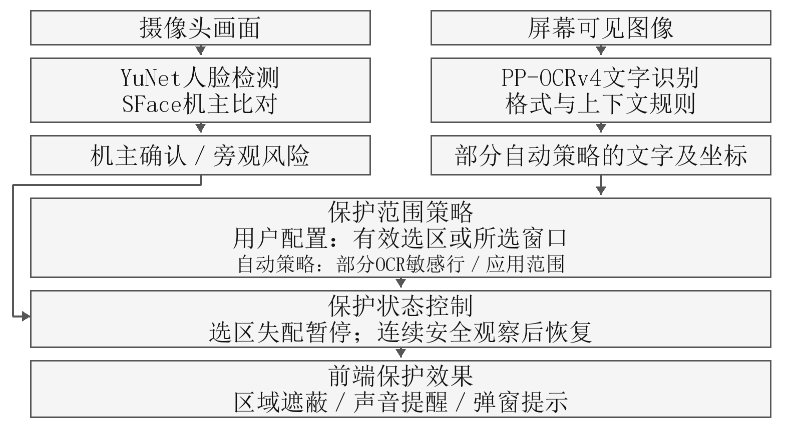

# 视界盾 公共学习空间内容防窥系统

作品简介
视界盾面向公共学习空间中查看、核对和填写个人材料的任务，结合人脸检测、机主比对及桌面范围策略，在旁观风险出现时遮蔽和提醒，安全状态持续后恢复。当前Windows测试版支持局部及整窗保护、范围跟随、模糊强度调节和独立声音、弹窗提示。OCR参与部分自动文字策略，指定范围由用户配置决定。项目已完成界面、打包及启停检查，并形成10题问卷和10份AI模拟情境作答，用于梳理需求假设。真实需求与隐私收益将通过用户预试、持续双人检测和虚构材料对照试验验证。

## 一、项目概述

### （一）背景与意义

学生在图书馆、共享自习区等公共学习空间使用电脑时，可能需要核对实习申请、个人简历和校园办事材料。这类页面常将任务说明与手机号、住址、账号等个人信息放在一起。用户需要反复查看和填写，旁人经过时临时切换窗口会中断操作，长期隐藏整页则影响阅读。视界盾以个人材料处理为拟验证场景，研究如何在旁观风险出现时保护指定内容，并让用户继续使用其余界面。

物理防窥膜通过限制部分观看方向降低可读性；手动切窗由使用者决定隐藏时机；已有摄像头旁观检测产品能够提醒或保护屏幕[1]。视界盾将研究重点放在任务中的保护范围、范围变化和恢复条件。场景的新颖性与使用收益需要由用户需求和任务试验支撑，现阶段已完成桌面原型搭建。

### （二）目标定位

本项目参加算法创新赛的赛题4“AI+场景创新”。目标用户为在公共学习空间处理个人材料的Windows电脑使用者，第一阶段覆盖主显示器上的可见内容。软件利用人脸检测与机主比对提供风险线索，结合用户范围配置、应用策略和部分OCR结果控制保护动作。

项目目标包括保持保护范围与当前窗口或内容位置一致、减少临时隐藏窗口的操作，以及在风险消失后恢复正常显示。验证将同时观察旁观者能否辨认目标字段和机主能否完成核对任务。当前技术基于公开预训练模型，研发工作集中于模型接入、范围跟随、状态协同、界面交互和Windows部署。

## 二、需求分析

### （一）问题剖析与使用边界

个人材料处理同时涉及内容和环境两个方面。用户对字段的敏感程度有不同判断，页面也会随着滚动、编辑及窗口移动发生变化；旁观者出现的时间和位置则难以由机主持续观察。保护方案需要让用户确定边界，检查范围是否仍有效，并在风险状态与安全状态之间稳定切换。

表1 场景需求与当前响应

| 任务情况 | 关键需求 | 当前响应 |
| --- | --- | --- |
| 独处查看或填写 | 正常阅读，不反复登记 | 本人首次明确登记；日常自动比对机主模板。 |
| 旁人进入摄像头视野 | 及时降低内容可见性 | 额外人脸或机主未确认触发保护请求。 |
| 移动窗口或滚动材料 | 遮蔽跟随有效范围 | 结合窗口、控件位置和图像特征进行范围跟随。 |
| 只保护部分内容 | 让用户控制保护边界 | 支持指定局部范围或绑定单个窗口。 |
| 风险持续消失 | 恢复阅读且减少闪烁 | 结合新的连续安全观察延时恢复。 |

摄像头检测到额外人脸表示存在旁观线索，不能据此判断对方的意图。人物在视野之外、严重模糊或被遮挡时，检测效果受限。遮罩改变屏幕上显示的图像，机主与旁观者看到相同的保护效果。用户暂停或退出后停止保护；局部范围跟随失配时暂停该选区遮蔽并提示重新选择。

### （二）问卷设计与模拟需求分析

项目已完成10题问卷设计与10个模拟角色的情境作答。题目覆盖使用场所、频率、材料与敏感字段、旁观顾虑、已有应对方式、保护粒度、提醒、摄像头接受条件及停止使用原因。问卷保留无需求、不遮蔽和拒绝摄像头选项，用于检查方案能否容纳不同偏好。

本轮作答由生成式AI依据国内校园生活和材料处理情境构造，没有招募、访问或收集真人回答。角色、经历与偏好均为模拟设定，结果用于提出需求假设和准备问卷预试，不作为国内大众需求统计、真实用户反馈或应用效果佐证。问卷和逐份作答见附录。

表2 十个模拟情境的作答分布

| 分析维度 | 模拟作答计数 | 设计启示 |
| --- | --- | --- |
| 处理频率 | 没有1；每月1—2次4；每周1—2次3；每周3次及以上2 | 同时保留低频启用和持续运行需求。 |
| 保护偏好 | 局部4；整窗2；自动文字2；仅提醒1；不需要1 | 范围可选，并保留暂停和仅提醒。 |
| 提醒偏好 | 静默4；弹窗3；音效1；两者同时1；无需提醒1 | 声音与弹窗独立配置。 |
| 摄像头态度 | 条件接受6；愿意先试用2；拒绝2 | 告知、启停与模板管理应清楚；保留替代路径。 |

这些分布是人为构造的十个情境之间的差异，不能据其推算市场比例、需求普及率或统计显著性。开放作答进一步提出误遮、低强度仍可读、小字号漏识别、范围失配、隐私和资源占用等检验问题。需求优先级结合当前实现与故障记录确定，而不按模拟计数决定。

### （三）需求假设与功能对应

表3 由模拟情境提出的需求假设

| 需求假设 | 对应功能与现状 | 真实验证方式 |
| --- | --- | --- |
| 保护范围偏好存在差异 | 局部、整窗和应用策略已实现；全面逐字段能力未完成 | 记录真实用户选择、配置耗时与误遮。 |
| 公共学习空间提醒应可控 | 声音与弹窗可分别开关 | 观察任务中断及周围干扰反馈。 |
| 可用性影响持续使用 | 低头宽限、跟随与恢复已接入；持续双人仍需改进 | 测误保护、漏检、最长暴露及恢复。 |
| 摄像头接受度有条件 | 明确启停已实现；模板加密、删除与替代流程待完善 | 真实预试询问授权条件并检查操作。 |

下一阶段以这份问卷开展3—4人的真实认知预试，检查题意、选项覆盖和填写时间，再拟邀请8—12名有相关经历的学生实际作答或访谈。保存匿名编号、招募条件和有效答卷数，分别记录主观偏好与软件测试结果。真实数据形成后独立汇总，与模拟情境分开归档，不补造既有作答。

## 三、解决方案设计

### （一）技术路线与系统架构

软件采用PySide6原生界面和独立后台进程。界面提供启用、暂停、设置和退出入口，关闭主窗口后驻留托盘。启动界面及暂停状态不加载识别模型，启用保护后由后台并行处理摄像头和屏幕任务，通过本机通信传递状态及区域信息。暂停时结束后台任务并释放设备和模型。

架构的数据层处理内存中的摄像头帧、屏幕图像和本机设置；识别层完成人脸检测、机主比对及屏幕文字识别；策略层结合用户范围、应用类型和结果有效期决定动作；应用层负责区域遮蔽、声音与弹窗提醒。图1区分两类范围来源，指定范围的保护动作可由人脸风险直接触发。

表4 模型与技术的实际作用

| 模块 | 当前实现 | 场景作用 |
| --- | --- | --- |
| 人脸检测 | YuNet；优先ONNX Runtime，加载失败回退OpenCV | 提供人脸位置与额外人脸线索。 |
| 机主比对 | SFace特征与本人登记模板比较 | 支持机主离开、低头或转头后的重新确认。 |
| 文字识别 | RapidOCR与PP-OCRv4；文字检测和识别已启用 | 为部分自动策略提供可见文字和文字框。 |
| 敏感判断 | 格式、标签及邻近文字规则 | 识别手机号、邮箱、身份证、验证码及部分账号信息。 |
| 范围跟随 | 窗口与控件位置、ORB图像特征 | 检查选区位置及其有效性。 |
| 保护控制 | 状态机与Qt覆盖窗口 | 根据有效范围进行遮蔽、提醒和恢复。 |

首次机主登记由本人明确操作，采集12个通过质量检查的单人脸特征并保存模板。日常运行进行特征比对，结合连续状态确认机主；短时低头和偏头采用有限宽限处理。陌生人的身份不建立档案。人脸检测优先加载ONNX Runtime路径的YuNet模型，初始化失败时回退到OpenCV加载的备用YuNet模型；两条路径使用的模型文件版本不同。模型来源见[3]，项目未训练新的通用人脸网络。

### （二）保护策略与OCR作用

当前软件包含OCR链路，但各模式对OCR的依赖不同。用户指定局部或整窗范围后，风险动作覆盖该有效配置范围；OCR任务仍可运行，其敏感文字框不决定这一模式的遮蔽粒度。未配置范围时，软件按应用类型采用默认策略，普通应用可依据OCR敏感文字框处理，聊天及指定文档、图片应用采用较宽范围保护。

表5 当前模式与范围来源

| 保护模式 | 范围来源 | OCR与遮蔽的关系 |
| --- | --- | --- |
| 指定局部 | 用户选择的有效选区 | 保护粒度由选区决定；失配时暂停并提示重选。 |
| 指定整窗 | 用户绑定的单个窗口 | 保护所选窗口；不连带同应用其他窗口。 |
| 自动策略中的普通应用 | OCR敏感行与有效坐标 | OCR提供文字和位置，规则决定命中类别。 |
| 自动策略中的特定应用 | 聊天、文档或图片应用策略 | 采用较宽范围，不能作为逐字段OCR保护展示。 |

OCR使用PP-OCRv4检测、识别模型，当前直接处理正向桌面文字，跳过判断文字是否需翻转的方向分类步骤。可用时通过DirectML执行，否则使用CPU。识别后的文字由规则判断，身份证结合格式、日期和校验，验证码结合关键词与邻近数字。OCR置信度表示识别结果的可信程度。当前规则尚不能覆盖全部私人聊天语义。UIA主要用于范围定位和诊断。

摄像头风险状态与内容分析独立更新。风险出现后按当前有效策略遮蔽；机主确认且新的安全观察持续满足条件后恢复，开发默认等待约1秒。状态失联、过期或乱序不作为安全证据。机主重新出现时若旁人仍在，继续保护。用户可以独立选择模糊、深色、声音和弹窗，水平滑杆用于调节模糊强度。

### （三）差异化设计与验证方向

视界盾当前的设计特点是让用户限定保护范围、跟随动态桌面位置，并将机主确认与区域保护动作连接起来。与手动切窗相比，自动风险触发可以减少发现旁人后的操作步骤；与整屏隐藏相比，局部范围为保留其他阅读区域提供条件。上述使用收益将通过任务完成表现和旁观可读性评测验证。

同类比较应区分光学防窥、旁观提醒和软件遮罩。Dell Optimizer已有旁观检测与隐私功能[1]；Eye-Shield研究了移动设备的肩窥显示保护[2]。视界盾的创新评估将围绕公共学习空间的任务适配和保护流程展开，保留各类方案的适用条件，不将成熟的旁观检测功能作为首次提出的技术。

## 四、项目实施

### （一）已完成工作与关键实现

项目已形成Windows x64便携测试版v0.1.0-preview.3，包含统一启动入口、原生界面与设置页、人脸身份模块、屏幕捕获与OCR、范围跟随、保护状态和桌面遮罩。发行包通过GitHub Release提供下载，使用者解压完整目录后运行，无需另外安装Python。实际使用仍需摄像头、捕获权限和本地模型。

人脸与OCR并行处理，输入队列有容量限制，只保留最新任务。稳定画面复用有效结果，变化区域优先重新识别，返回结果携带帧号与时间信息。保护前检查坐标和范围状态，减少滚动或窗口移动后使用旧位置的情况。模糊计算在设备可用时使用OpenCL，保留CPU回退。

已完成工程验证覆盖界面、包一致性、范围跟随和后台生命周期。后续实施以真实双人连续检测、保护时延、资源占用和用户任务评测为重点。具体提交时间按报名系统和所在赛区通知安排，表6采用任务阶段表示，不将完整研发排期等同于本次提交期限。

表6 后续任务与交付

| 阶段 | 主要任务 | 交付与验收 |
| --- | --- | --- |
| 真实需求核实 | 以已完成问卷做预试，再实际投放或访谈 | 真人匿名记录、题目修订及任务定义。 |
| 核心复测 | 持续双人、低头偏头、模糊遮挡；测时延与内存 | 分条件记录、故障复现及修复前后对比。 |
| 任务验证 | 比较无保护、手动隐藏与当前原型 | 字段辨认、任务时间、错误及误遮统计。 |
| 参赛交付 | 固定版本、录制演示、整理报告与复现资料 | 软件、视频、报告及佐证对应同一版本。 |

### （二）团队分工与协作

表7 成员职责与协作交付

| 角色 | 主要职责 | 协作成果 |
| --- | --- | --- |
| A 识别与状态 | 机主登记、身份比对、人脸风险及失联处理 | 状态接口、实人流程和检测记录。 |
| B 桌面与软件 | 捕获、OCR、范围跟随、界面、性能与打包 | 可运行版本、工程检查及性能结果。 |
| C 场景与验证 | 需求访谈、虚构材料、规则样本、标注与报告 | 需求对应表、授权资料和任务统计。 |

成员以职责代号列示，报名材料中补充真实成员信息，正文说明各成员的专业背景和实际贡献时遵循赛事匿名要求。协作采用GitHub任务分支和Pull Request，由负责人审查；约定风险消息序号、观察时间、机主状态和保护请求，以及OCR结果的帧号、文字框和有效期。源码、文档和虚构样本入库，个人模板、真实截图与设备日志留在本机。

## 五、测试与验证

### （一）当前工程结果

本节汇总公开测试版及对应工程记录。现有结果支持软件的启动、交互、范围动作和发行完整性，实际隐私收益由后续任务试验评估。源码核对日期为2026年10月10日，软件版本与复现入口见附录。

表8 已完成的工程验证

| 检查项 | 现有结果 | 验证范围 |
| --- | --- | --- |
| 界面与交互 | 100项检查通过；100%、125%、150%离屏布局检查无横向溢出 | 相关界面行为和布局。 |
| 软件包一致性 | 13项包检查通过；46个应用模块与源码一致 | 本次发行内容与预期源码一致。 |
| 动态范围 | 初始定位、窗口移动、内部移动及缩放检查通过 | 已覆盖的范围跟随动作。 |
| 后台生命周期 | 一次32.406秒检查；退出码0、无超时、后台关闭 | 启用、效果切换、暂停及退出。 |
| 下载完整性 | 4个附件大小和SHA-256一致；3个ZIP通过CRC检查 | 公开附件可下载且文件完整。 |

工程记录中的32.406秒是整次运行检查的总时长。后台及子进程峰值私有内存约1878.2 MB，后续需要分别分析空闲界面、运行状态及暂停后的资源释放。现有实人测试出现过身后人脸模糊、遮挡、小脸及持续双人间歇漏检，尚缺少逐帧真值，真实场景召回率仍待测量。

### （二）效果评测方案与指标

摄像头评测固定软件版本、摄像头、光照、人物距离和动作时序。安排本人独处、低头偏头、旁人在身后左右持续露脸及离开等情况，标记实际可见时间段，统计单人误保护、双人漏检和最长连续漏检。参与者在知情同意后参加受控测试，默认不保存画面；确需录像标注时另行明确授权、访问范围和删除时间。

OCR评测在记事本或普通浏览器显示虚构手机号、验证码、账号及普通数字，在未配置指定范围的自动策略下检查文字识别、规则命中和遮蔽位置。局部及整窗模式单独测试范围跟随、失配提示和恢复，避免将指定范围遮蔽效果记为OCR识别成功。

表9 后续效果指标与测量方式

| 指标 | 测量方式 | 报告要求 |
| --- | --- | --- |
| 人脸风险可靠性 | 标记真实单人和双人可见区间，统计误保护与漏检 | 按距离、模糊、遮挡分组；报告最长漏检。 |
| 内容保护正确性 | 虚构字段逐项标注；检查OCR、规则和坐标 | 分别报告漏保护与误遮。 |
| 端到端响应 | 记录风险进入视野到遮罩可见；另测新文字到有效保护 | 报告P50、P95与最长暴露间隔。 |
| 遮蔽可读性 | 旁观者辨认虚构字段，比较无保护及不同强度 | 按字段和保护模式统计正确辨认率。 |
| 使用负担 | 记录任务完成时间、填写错误、手动切换和误遮 | 与无保护、手动隐藏进行对照。 |
| 资源与稳定性 | 记录启用、持续运行、暂停后的内存和CPU | 注明硬件、版本、运行时长和异常。 |

任务试验先由3—4名参与者检查流程，再拟邀请12—18名未参与流程调试者完成虚构材料核对。无保护、手动隐藏和当前原型使用等难度、不同答案材料并调整顺序，减少练习影响。样本人数属于计划，招募后根据预试和分析需求调整。报告同时呈现旁观辨认与机主表现，并说明失败情况。

OCR在内容显示后进行分析，新增文字到定位完成之间存在检测空档。采集间隔、模型推理和端到端保护时延分别记录；500 ms作为响应优化目标时，应附测试条件，达标情况以实测结果判定。指定范围模式可以先覆盖已配置有效范围，自动文字策略则需要等待内容及位置结果。

## 六、应用效果与成果

### （一）现有成果与适用条件

当前成果为可下载的Windows便携原型、配套源码、界面与设置、工程检查脚本、发行校验资料及问卷与模拟需求分析材料。软件支持机主登记、自动身份比对、风险联动、用户范围保护、模糊及深色效果、独立声音和弹窗提醒，以及暂停和退出时的设备释放。尚未完成正式公共空间试点，用户效率和隐私收益数据将在任务评测后补充。

原型适用于主显示器、可采集桌面和可用摄像头的Windows x64环境。最低硬件要求需在不同电脑上验证后公布，GPU加速可选。受限窗口、严重模糊及遮挡、范围跟随失配等情况影响可用性；状态界面和使用说明需让用户了解当前保护是否有效。

### （二）落地安排与隐私管理

落地先通过参与者自愿安装和虚构材料任务验证，再取得场地管理方同意开展小规模授权试用。资源需求包括测试电脑、摄像头、参与者协调和场地；当前不依赖云端识别服务。推广依据保护效果、兼容性和使用反馈逐步扩大，社会效益通过减少可辨认字段和降低临时隐藏负担衡量。

软件默认不保存摄像头画面、屏幕截图和聊天原文。设置、机主特征模板及部分运行记录会在本机留存，当前模板尚未加密。公开包不含个人模板，发行过程排除真实画面、原文及设备日志。日志内容、启用方式和留存期限应在使用说明中分别列明。

正式试点前根据实际部署开展适用性与合规审查，落实登记告知、必要授权、最小留存、模板删除与撤回流程，并评估经过者和屏幕内容相关方的权益。下一阶段补充模板加密与管理入口、手动保护替代方式，核查模型和发行依赖许可。涉及人脸信息的处理参照相关规定开展个人信息保护影响评估[4]，授权测试范围不延伸为公共空间持续监控。

## 七、总结与展望

### （一）阶段成果总结

视界盾已将人脸检测、机主特征比对、桌面范围控制及遮蔽提醒整合为单入口Windows原型，完成界面、范围跟随、后台生命周期和发行包验证。软件允许用户决定保护边界，部分自动策略使用OCR和敏感规则，为公共学习空间个人材料处理提供了可测试的方案。当前成果包括工程实现、可复现原型与已明确来源的模拟需求分析，真实用户收益仍待任务试验验证。

### （二）当前问题与改进顺序

本轮已完成问卷和模拟情境分析。后续首先开展真实问卷预试，并提高持续双人、模糊遮挡和小脸情况下的检测稳定性，测量端到端响应和运行内存；再开展真实用户作答和虚构材料对照试验，检验范围配置、模糊强度和恢复策略对任务的影响。OCR优化重点是有效区域识别、结果时效和规则覆盖，功能拓展依据调研和测试结果决定。

范围失配仍需用户重新选择，全面聊天语义识别、多显示器和远程共享保护尚未完成。模板安全、告知和删除流程在授权试点前补齐。下一版以主要故障可复现、修复可验证和收益可量化为验收原则，再根据实际条件扩展应用范围。

## 八、附录

### （一）版本与复现说明

作品名称为视界盾 公共学习空间内容防窥系统。公开测试版为v0.1.0-preview.3，发行软件对应源码提交975e940a65d99d769fab2d74a0994970c60adec9，本文核对源码基线为5db45006886befc93087d1bf31b09edab7acd9c0。源码和工程说明见[5]，发行包与校验值见[6]。

复现时下载对应版本、校验文件并解压完整目录，保留_internal内容。首次由本人完成登记。用虚构材料分别检查指定局部、指定整窗和普通应用自动文字策略，记录软件、硬件及设置。工程资料包括《公开下载与封装模板_20261007》、相关模块和验收脚本；历史记录按其对应版本解释。公开预训练模型及依赖的来源、版本和许可随发行说明提供。

演示按启动与启用、本人登记和确认、选择保护范围、旁人持续露脸触发遮蔽和提醒、窗口移动及范围状态、旁人离开后恢复、暂停退出的顺序录制。OCR片段另在普通应用的自动策略下展示虚构敏感字段与普通数字，并说明结果由文字模型和规则共同产生。人物与屏幕均取得必要授权，真实运行时间如实展示。

参赛附件按报名系统要求提供方案PDF、3—5分钟MP4演示、答辩PDF、真实佐证及其他材料网盘链接。方案不超过10 MB，视频不超过300 MB，作品名称不超过20字、简介不超过300字；所有公开评审材料检查学校名称、学校Logo及指导教师信息。代码与复现资料按规定命名，排除个人模板、截图、真实聊天和本机设备记录[7]。

### （二）需求问卷

填写说明：本问卷用于了解公共学习空间中的个人材料处理需求，填写自愿，可跳过不愿回答的问题。请依据实际经历回答，不填写真实姓名、学号、账号、联系方式或材料原文。正式收集前说明用途、保存方式、保管期限及撤回渠道。以下为待预试问卷，附录后续作答为模拟示例。

Q1 你通常在哪些公共空间使用电脑处理个人材料？

可多选：图书馆；共享自习区或教室；宿舍公共桌；咖啡店或共享办公区；基本不在公共空间处理。

Q2 过去一个月，在这些空间处理含个人信息材料的频率如何？

单选：没有；每月1—2次；每周1—2次；每周3次及以上。

Q3 你处理过或可能需要处理哪些材料？

可多选：简历或实习申请；校园办事表单；奖助学金或家庭材料；账号登录与验证码；个人聊天；基本没有。

Q4 其中哪些信息是你希望避免被旁人读到的？

可多选：联系方式或地址；身份证或学号；账号与验证码；家庭或财务信息；聊天内容；没有特别需要隐藏的信息。

Q5 处理上述材料时，你对旁人读到屏幕内容有多担心？

单选1—5：1完全不担心；2较少担心；3一般；4比较担心；5非常担心。

Q6 目前你会如何处理旁观风险？

可多选：调整座位或屏幕；切换或最小化窗口；使用防窥膜；等待人少时再处理；不做特别处理。

Q7 如果试用防窥工具，你最希望它如何保护？

单选：自己选择局部范围；选择整个窗口；自动识别部分敏感文字；只提醒不遮蔽；暂时不需要该工具。

Q8 你能接受哪种提醒方式？

单选：静默状态变化；弹窗；音效；音效加弹窗；不需要任何提醒。

Q9 你是否接受工具使用摄像头识别机主与旁观风险？

单选：愿意先试用；仅在本地处理、明确启停并可删除模板时考虑；不接受摄像头，偏好手动保护；暂时无法判断。

Q10 什么情况会让你停止使用？还希望改善什么？

开放题：可说明误遮、漏保护、模糊程度、响应、耗电、权限、隐私或其他问题，也可填写暂时没有。

### （三）模拟角色与逐份作答

以下S01—S10为生成式AI构造的角色，全部回答为模拟，不对应真实个人。Q1—Q6在表中展示，Q7—Q10依次列出；计数只描述这组情境。

模拟作答表A 使用情境与材料

| 编号与角色 | Q1场所及Q2频率 | Q3材料 Q4私密信息 Q5顾虑 Q6现有方式 |
| --- | --- | --- |
| S01 本科生 求职准备 | 图书馆；每周1—2次 | Q3 简历或实习申请；Q4 联系方式或地址、身份证或学号；Q5 4；Q6 切换或最小化窗口 |
| S02 本科生 校园办事 | 共享自习区或教室；每月1—2次 | Q3 校园办事表单、账号登录与验证码；Q4 身份证或学号、账号与验证码；Q5 3；Q6 调整座位或屏幕 |
| S03 本科生 奖助材料 | 图书馆、宿舍公共桌；每月1—2次 | Q3 奖助学金或家庭材料；Q4 家庭或财务信息、身份证或学号；Q5 5；Q6 等待人少时再处理 |
| S04 研究生 简历修改 | 咖啡店或共享办公区；每周1—2次 | Q3 简历或实习申请、账号登录与验证码；Q4 联系方式或地址、账号与验证码；Q5 4；Q6 使用防窥膜 |
| S05 本科生 普通课程学习 | 共享自习区或教室；没有 | Q3 基本没有；Q4 没有特别需要隐藏的信息；Q5 1；Q6 不做特别处理 |
| S06 本科生 账号操作 | 宿舍公共桌；每周3次及以上 | Q3 账号登录与验证码、个人聊天；Q4 账号与验证码、聊天内容；Q5 4；Q6 切换或最小化窗口 |
| S07 研究生 校园表单 | 图书馆；每月1—2次 | Q3 校园办事表单；Q4 身份证或学号、联系方式或地址；Q5 3；Q6 调整座位或屏幕 |
| S08 本科生 聊天与材料切换 | 咖啡店或共享办公区、图书馆；每周1—2次 | Q3 个人聊天、简历或实习申请；Q4 聊天内容、联系方式或地址；Q5 2；Q6 切换或最小化窗口 |
| S09 本科生 对摄像头较谨慎 | 图书馆；每月1—2次 | Q3 校园办事表单、奖助学金或家庭材料；Q4 家庭或财务信息、身份证或学号；Q5 4；Q6 等待人少时再处理 |
| S10 研究生 高频材料核对 | 共享自习区或教室、图书馆；每周3次及以上 | Q3 简历或实习申请、校园办事表单；Q4 联系方式或地址、身份证或学号；Q5 4；Q6 切换或最小化窗口、调整座位或屏幕 |

模拟作答表B 保护与授权偏好

| 编号 | Q7保护 Q8提醒 Q9摄像头 | Q10开放回答 |
| --- | --- | --- |
| S01 | Q7 自己选择局部范围；Q8 静默状态变化；Q9 仅在本地处理、明确启停并可删除模板时考虑 | 不希望每次低头都遮住材料；选好范围后希望能跟随窗口。 |
| S02 | Q7 选择整个窗口；Q8 弹窗；Q9 仅在本地处理、明确启停并可删除模板时考虑 | 使用频率低，最好简单启停；保护失效时要看得出来。 |
| S03 | Q7 选择整个窗口；Q8 静默状态变化；Q9 仅在本地处理、明确启停并可删除模板时考虑 | 家庭材料更愿意遮整个窗口；不能偷偷保存截图。 |
| S04 | Q7 自动识别部分敏感文字；Q8 弹窗；Q9 愿意先试用 | 想保留正文阅读，只挡敏感字段；小字号漏识别会影响信任。 |
| S05 | Q7 暂时不需要该工具；Q8 不需要任何提醒；Q9 不接受摄像头，偏好手动保护 | 平时没有这类需求，不愿为防窥一直开摄像头。 |
| S06 | Q7 自动识别部分敏感文字；Q8 静默状态变化；Q9 仅在本地处理、明确启停并可删除模板时考虑 | 验证码保护要快；低强度模糊还能读出数字就没有意义。 |
| S07 | Q7 自己选择局部范围；Q8 弹窗；Q9 仅在本地处理、明确启停并可删除模板时考虑 | 愿意先手选信息区域，不希望扩展到其他窗口；范围丢失要提示。 |
| S08 | Q7 只提醒不遮蔽；Q8 音效；Q9 愿意先试用 | 自动遮蔽可能打断操作，希望能关掉遮蔽只留提醒。 |
| S09 | Q7 自己选择局部范围；Q8 静默状态变化；Q9 不接受摄像头，偏好手动保护 | 不愿登记脸部特征，更倾向快捷键手动保护；资源占用不能太高。 |
| S10 | Q7 自己选择局部范围；Q8 音效加弹窗；Q9 仅在本地处理、明确启停并可删除模板时考虑 | 长时间使用要稳定；恢复不能反复闪烁，暂停后应释放资源。 |

### （四）参考资料

[1] Dell. Dell Optimizer overview and common questions. https://www.dell.com/support/kbdoc/en-us/000128673/dell-optimizer-over-view-and-common-questions （访问日期 2026-10-10）。

[2] TANG B J, SHIN K G. Eye-Shield Real-Time Protection of Mobile Device Screen Information from Shoulder Surfing. USENIX Security 2023. https://www.usenix.org/conference/usenixsecurity23/presentation/tang （访问日期 2026-10-10）。

[3] OpenCV. OpenCV Zoo YuNet and SFace. https://github.com/opencv/opencv_zoo （访问日期 2026-10-10）。

[4] 国家互联网信息办公室 公安部. 人脸识别技术应用安全管理办法. 2025-03-21. https://www.cac.gov.cn/2025-03/21/c_1744174262342111.htm （访问日期 2026-10-10）。

[5] 视界盾项目组. VisionShield源码及工程说明. https://github.com/dujh413/VisionShield （访问日期 2026-10-10）。

[6] 视界盾项目组. VisionShield v0.1.0-preview.3. https://github.com/dujh413/VisionShield/releases/tag/v0.1.0-preview.3 （访问日期 2026-10-10）。

[7] 全球校园人工智能算法精英大赛组委会. 2026AIC算法创新赛赛题规则汇总及AI+场景创新赛题. https://www.aicomp.cn/tracks/tracks-2/3802.html （访问日期 2026-10-10）。
